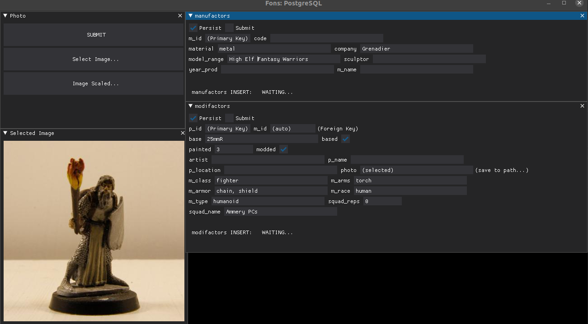

# pupillae

##### A coven of tools to assist PnP RPGs.

###### *Status*: Pre-alpha.

- Testing. Adding necessary functions and features as discovered/required.

###### *Other-than-Pythonic-dependencies*:

- Linux (likely. Although it is fairly universal, I am unlikely to test the code in a Windows environment),
- PostgreSQL (13+).
- Discord.

### To Install:

###### Setup:
- Ensure you have installed psycopg2 dependencies:
	- This may require using aptitude instead of apt, e.g. `sudo aptitude install python3-dev` and choosing to downgrade `2.31-0ubuntu9.3 -> 2.31-0ubuntu9.2` to install libc6*.

The docs/tutorials for psycopg2, PostgreSQL and Ubuntu Server 20.04 are well written. Downloading the source tar for psycopg2 may be required.`echo $PATH` is handy.

1. Clone this github repo.
2. Open your poetry shell in the directory.
3. Execute `poetry install`
4. Configure conf.ini with appropriate details using the template as a guide.

### fons

Purpose: Create or enter data.
- Enter miniature data into a database. (fons_gui.py)
- Create randomised data. (Currently this is just dice_roller.py).

### pales

Purpose: Parse the data and package it for viewing in some manner.
- Discord bot scripts

#### Notes:
Current paths may be dicey.

Various tweaks may be required to adapt the tools to your needs, but I hope they provide some use.
